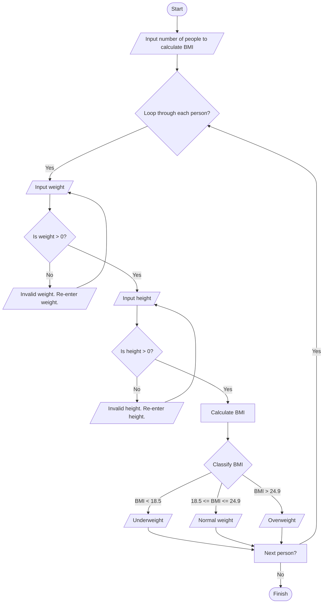

**Problem Description**:  
This program calculates the Body Mass Index (BMI) of a user based on their weight (in kilograms) and height (in centimeters). The program also classifies the BMI into categories such as underweight, normal weight, overweight, or obese. It includes input validation to ensure the weight and height are positive numbers. The program can repeatedly calculate BMI for multiple users until the user decides to exit.

**Problem Analysis**:  

*Input*:  
- weight (integer): Weight in kilograms  
- height (integer): Height in centimeters  
- repeat (character): User's choice to continue or exit ('y' or 'n')  

*Output*:  
- BMI value (float)  
- BMI category:  
  - Underweight: BMI < 18.5  
  - Normal weight: 18.5 ≤ BMI < 25  
  - Overweight: 25 ≤ BMI < 30  
  - Obese: BMI ≥ 30  

*Process*:  
1. Prompt the user to input their weight and height.
2. Validate the inputs:
   - Ensure weight is a positive number.
   - Ensure height is a positive number.
3. Calculate BMI using the formula:  
   BMI = weight / ((height / 100) * (height / 100))
4. Classify BMI into one of the categories.
5. Ask the user if they want to calculate BMI again.
6. Repeat the process if the user enters 'y' or 'Y'; otherwise, terminate the program.

---
**Flowchart**:

**pseudocode**:  

1. Start.  
2. Declare variables: weight, height, bmi (float), and repeat (char).  
3. Set repeat = 'y'.  
4. While repeat is 'y' or 'Y':  
   - Prompt the user to enter weight and validate:
     - If invalid (non-positive), prompt again.
   - Prompt the user to enter height and validate:
     - If invalid (non-positive), prompt again.
   - Calculate BMI: bmi = weight / ((height / 100) * (height / 100)).  
   - Display BMI and its category:
     - BMI < 18.5: "Underweight".  
     - 18.5 ≤ BMI < 25: "Normal weight".  
     - 25 ≤ BMI < 30: "Overweight".  
     - BMI ≥ 30: "Obese".  
   - Ask if the user wants to calculate BMI again (repeat).  
     - Validate repeat to be either 'y' or 'n'.  
5. Display a thank-you message and end the program.

---
