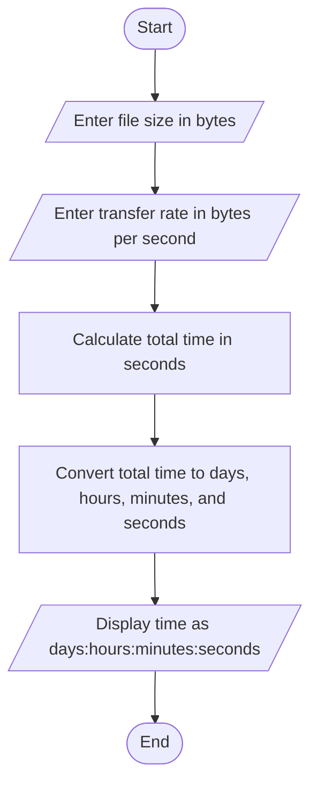

PROBLEM ANALYSIS:

INPUT: file size and the transmission rate

OUTPUT: the time required in hours, minutes and 
 Seconds separately.

PROCESS: compute the required time using the formula file size /transmission rate(960)

PSEUDOCODE:

Step 1: start

Step 2:read the file size

Step 3:compute timefile size /transmission rate(960)

Step 4: print time required in hours, minutes and 
 Seconds

Step 5:stop

FLOWCHART:

